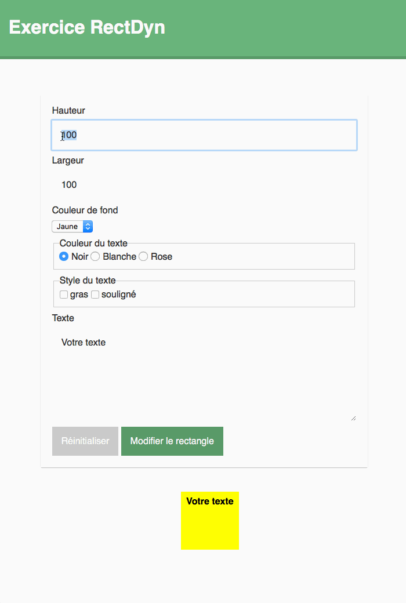

# Module 133a > Exercice “RectDyn”

## Objectifs de l’exercice

Créer un formulaire Web permettant à l’utilisateur de modifier l’aspect et le contenu d’un élément 
.

## A lire avant de commencer

- [Manipuler une page Web via le DOM en JavaScript](https://divtec.gitbook.io/133a/javascript/dom-introduction/introduction)
- [Accéder aux éléments HTML d’une page Web en JavaScript](https://divtec.gitbook.io/133a/javascript/dom-introduction/dom-acceder)
- [Modifier les contenus textes des éléments HTML en JavaScript](https://divtec.gitbook.io/133a/javascript/dom-introduction/dom-modifier-texte)
- [Modifier le style CSS des éléments HTML en JavaScript](https://divtec.gitbook.io/133a/javascript/dom-introduction/modifier-le-style-css)
- [Gérer l’envoi d’un formulaire HTML en JavaScript](https://divtec.gitbook.io/133a/javascript/formulaires/capter-lenvoi-du-formulaire)
- [Récupérer et modifier la valeur des champs d’un formulaire HTML en JavaScript](https://divtec.gitbook.io/133a/javascript/formulaires/recuperer-la-valeur-des-champs)
- [Valider les saisies utilisateurs d’un formulaire HTML en JavaScript](https://divtec.gitbook.io/133a/javascript/formulaires/valider-les-saisies-utilisateurs)

### Tutos OpenClassrooms

- [Manipuler le code HTML 1re partie](https://openclassrooms.com/courses/dynamisez-vos-sites-web-avec-javascript/manipuler-le-code-html-partie-1-2)
- [Manipuler le code HTML 2e partie](https://openclassrooms.com/courses/dynamisez-vos-sites-web-avec-javascript/manipuler-le-code-html-partie-2-2)
- [Les événements](https://openclassrooms.com/courses/dynamisez-vos-sites-web-avec-javascript/les-evenements-24)
- [Les Formulaires](https://openclassrooms.com/courses/dynamisez-vos-sites-web-avec-javascript/les-formulaires-1)
- [Manipuler le CSS](https://openclassrooms.com/courses/dynamisez-vos-sites-web-avec-javascript/manipuler-le-css)

------

## Formulaire HTML

- Créer le formulaire HTML dans le fichier index.html à l’endroit indiqué par les commentaires.
- Identifier le formulaire avec l’id “formRect”
- Structurer le formulaire avec une liste HTML non-triée.
- Labelliser et identifier chaque champs
- Respecter les bonnes pratiques de la création de formulaires Web.

### Détail des champs du formulaire

Tableau des champs du formulaire RectDyn

## JavaScript

### Fonction de mise à jour du rectangle

Créer une fonction **miseAJour()** qui se déclenche lors de l’envoi du formulaire : onsubmit. Travail de la fonction :

1. Vérifier que l’utilisateur à bien saisi dans les champs « hauteur » et « largeur » un nombre plus grand que 0 et inférieur ou égal 500.
2. Si l’utilisateur n’a pas entré un nombre afficher le message d’erreur : alert(‘Entrez un nombre !’)
3. Si le nombre n’est pas compris entre 0 et 500 afficher le message d’erreur : alert(‘Hauteur ou largeur incorrecte !’)
4. Modifier l’aspect de la div #rectangle en fonction des préférences de l’utilisateur :

- Taille (champs textes hauteur et largeur)
- Couleur de fond (liste déroulante)
- Couleur du texte (boutons radios)
- Style du texte (cases à cocher)
- Texte, contenu de la div (zone de texte)

### Réinitialisation du formulaire et de la div

Réinitialiser le formulaire ainsi que l’aspect et le contenu de la div #rectangle  lors de la réinitialisation du formulaire : onreset.

- [133a](https://medium.com/tag/133a)
- [HTML](https://medium.com/tag/html)
- [JavaScript](https://medium.com/tag/javascript)
- [Forms](https://medium.com/tag/forms)
